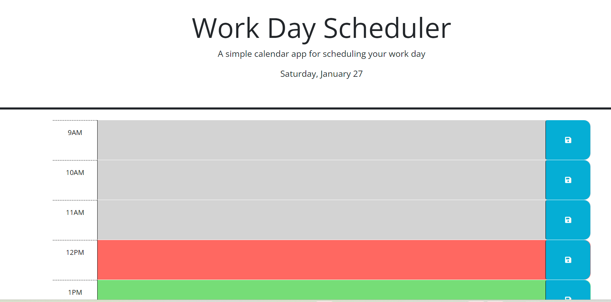

# workday-scheduler

## Description
A simple scheduler that lets you plan events for a day

## Usage
The scheduler shows the current date at the top, and time blocks for each hour from 9 am to 5 pm. Each time block can have information for what the user plans to do during that time. Time blocks in grey mean that the time has already past. Time blocks in red mean that it is the  block for the current time. Time blocks in
green mean that it is for a future time.

To save an entry in a time block, click on the time block and add what you want to
schedule, like "Go Grocery Shopping". Then click on the disk icon at the end of the
row to save the entry. All entries are persisted in local storage and will show up next time you visit or refresh the page. The max length of an entry for a time block is set to 200 characters. Use the 'Clear Day' button at the bottom of the screen as a convenient way of clearing any existing entries for the day. 

## Installation
N/A

## WebLink
https://milindmjoshi.github.io/workday-scheduler/

## Test Instructions
N/A

## License
MIT License
